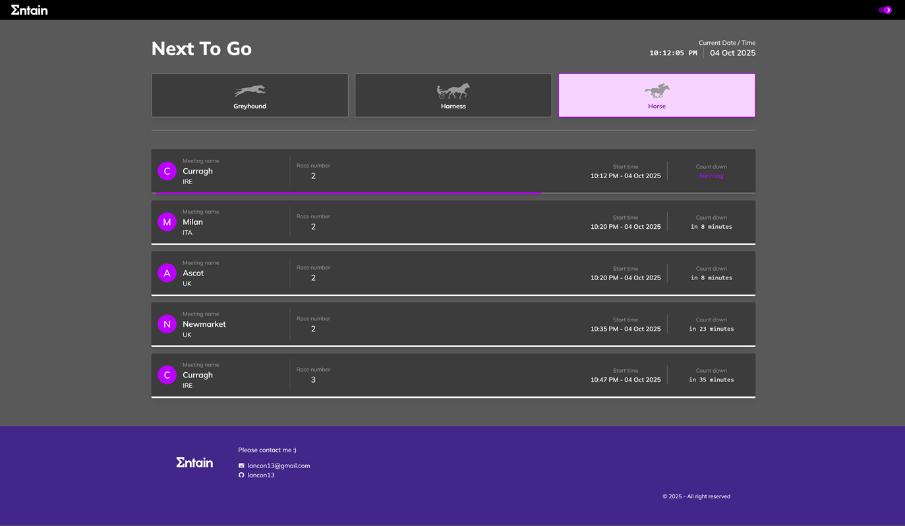
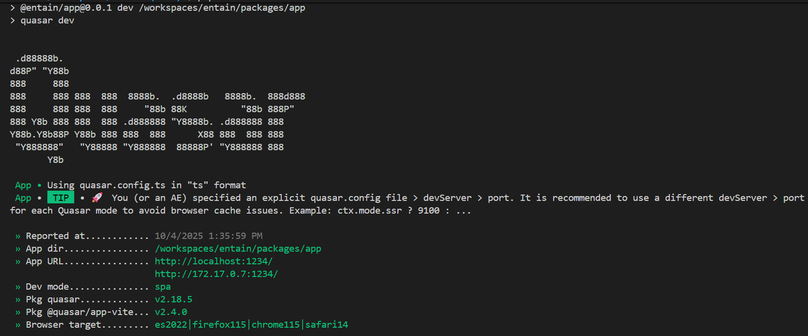
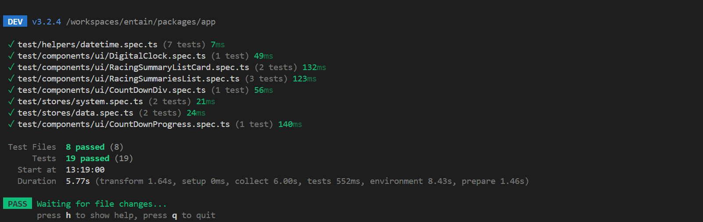

# Entain Racing App

This is a "Next To Go" racing application that displays a list of upcoming races. Users can filter races by category (greyhound, harness, horse) and see a countdown for each race.


## Features

- **Real-time Experience:** Live countdowns for each race.
- **Modern Tech Stack:** Built with Vue.js 3, Vite, Pinia, and TypeScript for a fast and type-safe development experience.
- **Comprehensive Test Setup:** Includes a full suite of unit tests using Vitest and Vue Test Utils.
- **Responsive Design:** A clean and responsive UI that works on all screen sizes.
- **Clean Architecture:** Organized as a monorepo with a component-based structure.
- **Theming:** Supports both light and dark modes.

## Screenshot



## Tech Stack

- **Framework:** [Quasar](https://quasar.dev/) (a Vue.js framework)
- **Language:** [TypeScript](https://www.typescriptlang.org/)
- **State Management:** [Pinia](https://pinia.vuejs.org/)
- **Styling:** [Tailwind CSS](https://tailwindcss.com/)
- **Package Manager:** [pnpm](https://pnpm.io/) (in a monorepo setup)

## Project Structure

This project is a monorepo with the main application located in the `packages/app` directory.

- `packages/app/src`: Contains the application's source code.
  - `components`: Reusable Vue components.
  - `pages`: Application pages.
  - `stores`: Pinia state management stores.
  - `router`: Vue Router configuration.
  - `layouts`: Quasar layouts.
  - `assets`: Static assets like images and logos.
  - `css`: Global CSS and SCSS files.

## Getting Started

### Prerequisites

- [Node.js](https://nodejs.org/) (version 18 or higher)
- [pnpm](https://pnpm.io/installation) (version 9 or higher)

### Installation

1.  Clone the repository:
    ```bash
    git clone https://github.com/lancon13/entain
    ```
2.  Install dependencies from the root of the project:
    ```bash
    pnpm install
    ```

### Running Locally

To start the development server, run the following command from the root of the project:

```bash
pnpm dev
```

This will start the Quasar development server, and you can view the application in your browser at `http://localhost:1234` (or the next available port).



### Building for Deployment

To build the application for production, run the following command from the root of the project:

```bash
pnpm build
```

This will create a `dist` folder in the `packages/app` directory with the production-ready files.

## Running Tests

This project uses [Vitest](https://vitest.dev/) and [Vue Test Utils](https://test-utils.vuejs.org/) for unit testing.

To run the tests, use the following command from the root of the project:

```bash
pnpm test
```

This will run all the unit tests for the `@entain/app` package.


